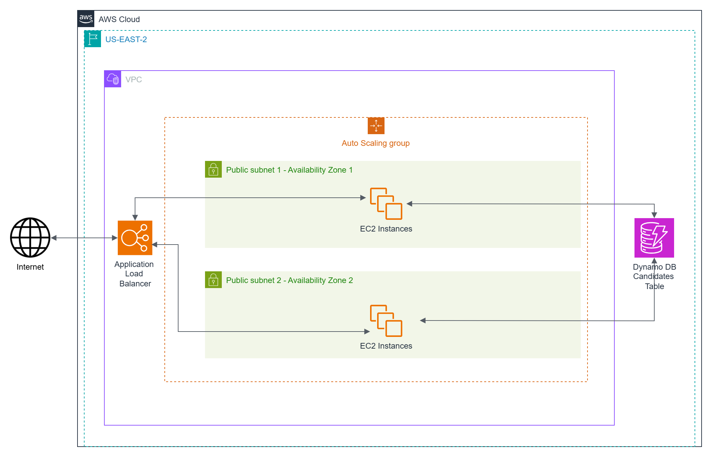
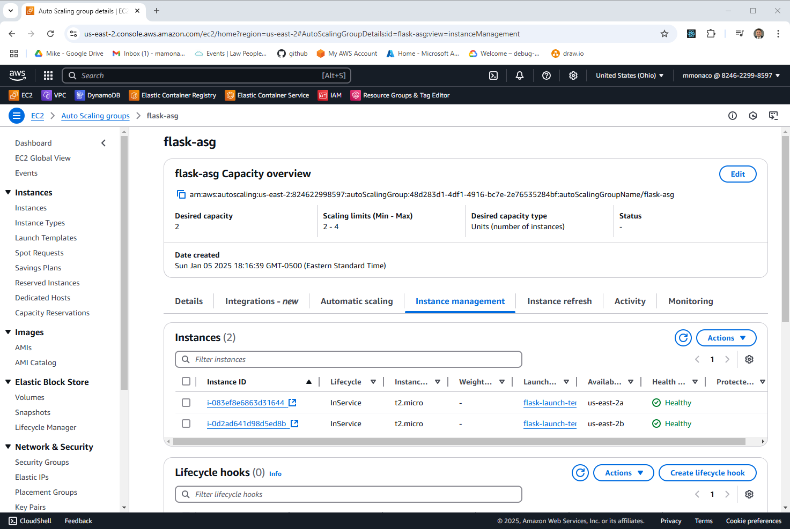

# AWS Autoscaling Example

This is Part 1 of the Series: [Scaling in the Cloud: AWS Auto Scaling, Azure VMSS, and GCP MIGs](https://youtu.be/i_T7Wu_mJ1k).

## Introduction

In this video, we will demonstrate the deployment of Flask-based microservices within an AWS Auto Scaling Group while covering the following tasks:

- **Deploy Flask-based microservices** on AWS EC2 instances.
- **Utilize Amazon DynamoDB** as a document database to store microservice data.
- **Create an Amazon Machine Image (AMI)** of the deployed services using Packer.
- **Configure an AWS Auto Scaling Group** to enable automatic scalability using `Terraform`
- **Simulate load** to test scalability and trigger scaling events.
- **Clean up resources** by decommissioning all infrastructure provisioned during the process.



## Prerequisites

* [An AWS Account](https://aws.amazon.com/console/)
* [Install AWS CLI](https://docs.aws.amazon.com/cli/latest/userguide/getting-started-install.html) 
* [Install Latest Terraform](https://developer.hashicorp.com/terraform/install)
* [Install Latest Packer](https://developer.hashicorp.com/packer/install)

If this is your first time watching our content, we recommend starting with this video: [AWS + Terraform: Easy Setup](https://youtu.be/BCMQo0CB9wk). It provides a step-by-step guide to properly configure Terraform, Packer, and the AWS CLI.

## Download this Repository

```bash
git clone https://github.com/mamonaco1973/aws-flask-asg.git
cd aws-flask-asg
```

## Build the Code

Run [check_env](build\check_env.sh) then run [apply](apply.sh).

```bash
~/aws-flask-asg$ ./build/check_env.sh
NOTE: Validating that required commands are found in your PATH.
NOTE: aws is found in the current PATH.
NOTE: packer is found in the current PATH.
NOTE: terraform is found in the current PATH.
NOTE: All required commands are available.
NOTE: Checking AWS cli connection.
NOTE: Successfully logged in to AWS.
~/aws-flask-asg$ ./apply.sh
NOTE: Validating that required commands are found in your PATH.
NOTE: aws is found in the current PATH.
NOTE: packer is found in the current PATH.
NOTE: terraform is found in the current PATH.
NOTE: All required commands are available.
NOTE: Checking AWS cli connection.
NOTE: Successfully logged in to AWS.
NOTE: Building infrastructure phase 1.
Initializing the backend...
Initializing provider plugins...
- Reusing previous version of hashicorp/aws from the dependency lock file
- Using previously-installed hashicorp/aws v5.82.2

Terraform has been successfully initialized!
[...]
```

### Build Process Overview

The build process is divided into three phases:

1. **Phase 1:** Use Terraform to provision all infrastructure with a generic launch template.
2. **Phase 2:** Build the Flask services into an AMI using the network elements created in Phase 1.
3. **Phase 3:** Create a new launch template using the AMI from Phase 2, and configure the instance scaling parameters:
   - Desired number of instances: 2
   - Minimum number of instances: 2
   - Maximum number of instances: 4


## Tour of Build Output in the AWS Console

Most of the build can be accessed on the **EC2** section of the AWS Console, where you will find the following key elements:

- **The Auto Scaling Group**
- **The currently running EC2 instances**
- **The Application Load Balancer**
- **The Scaling Policies**
- **The Launch Template associated with the Auto Scaling Group**



## Test the Services

We will test the services with [Postman](https://www.postman.com/downloads/). First run [validate.sh](validate.sh) to get the base URL for the build.

```bash
~/aws-flask-asg$ ./validate.sh
NOTE: Checking for healthy targets in target group flask-alb-tg.
NOTE: Healthy targets found on flask-alb-tg.
NOTE: Testing the EC2 Solution
NOTE: URL for EC2 Solution is http://flask-alb-1771338256.us-east-2.elb.amazonaws.com/gtg?details=true
✓ good to go passed
✓ insert passed
✓ verification passed
✓ candidate list passed
azureuser@develop-vm:~/aws-flask-asg$
```

Copy the value from validate `http://flask-alb-1771338256.us-east-2.elb.amazonaws.com/gtg?details=true` and paste into Postman.


### HTTP Endpoint Summary

#### `/gtg` (GET)
- **Purpose**: Health check.
- **Response**: 
  - `{"connected": "true", "instance-id": <instance_id>}` (if `details` query parameter is provided).
  - 200 OK with no body otherwise.

#### `/candidate/<name>` (GET)
- **Purpose**: Retrieve a candidate by name.
- **Response**: 
  - Candidate details (JSON) with status `200`.
  - `"Not Found"` with status `404` if no candidate is found.

#### `/candidate/<name>` (POST)
- **Purpose**: Add or update a candidate by name.
- **Response**: 
  - `{"CandidateName": <name>}` with status `200`.
  - `"Unable to update"` with status `500` on failure.

#### `/candidates` (GET)
- **Purpose**: Retrieve all candidates.
- **Response**: 
  - List of candidates (JSON) with status `200`.
  - `"Not Found"` with status `404` if no candidates exist.

## Simulate Load

The Autoscaling Group that was created has the following scaling policies defined in the terraform.

### Scale-Up Policy
- **Trigger**: When the average CPU utilization exceeds **60%** for **two consecutive evaluation periods** (each period is 30 seconds).
- **Scaling Action**: Adds **one instance** to the ASG (`scaling_adjustment = 1`).
- **Cooldown Period**: **120 seconds** between scaling actions to prevent over-scaling.
- **CloudWatch Alarm**:
  - Monitors the metric `CPUUtilization` from the `AWS/EC2` namespace.
  - Associates the alarm with the ASG using the dimension `AutoScalingGroupName`.

### Scale-Down Policy
- **Trigger**: When the average CPU utilization drops below **60%** for **10 consecutive evaluation periods** (each period is 30 seconds).
- **Scaling Action**: Removes **one instance** from the ASG (`scaling_adjustment = -1`).
- **Cooldown Period**: **120 seconds** between scaling actions to prevent under-scaling.
- **CloudWatch Alarm**:
  - Monitors the metric `CPUUtilization` from the `AWS/EC2` namespace.
  - Associates the alarm with the ASG using the dimension `AutoScalingGroupName`.

### Characteristics of the Scaling Policies

1. **CPU-Based Autoscaling**:
   - Scaling is based on the average CPU utilization of the instances in the ASG, a common approach to autoscaling.

2. **Asymmetric Scaling**:
   - The **scale-up policy** reacts quickly (2 periods, or 1 minute total) to rising CPU utilization.
   - The **scale-down policy** reacts more conservatively (10 periods, or 5 minutes total) to ensure workloads are not prematurely terminated.

3. **Change-In-Capacity Adjustment**:
   - Scaling is performed by incrementing or decrementing the number of instances by **1** at a time, rather than percentage-based or target tracking.

4. **Cooldown and Warmup Periods**:
   - Both scaling actions include a **120-second cooldown** to avoid excessive scaling operations during transient spikes or drops.
   - The ASG has a **60-second warmup period** to allow new instances to initialize before considering them for scaling decisions.

5. **Integration with Load Balancer**:
   - The ASG integrates with an ALB (Application Load Balancer) via the `target_group_arns` configuration, ensuring scaled instances are added or removed dynamically based on health checks.

6. **Scalability Boundaries**:
   - The ASG allows scaling between a **minimum size** (`min_size`) and a **maximum size** (`max_size = 4`).

We will access the EC2 instances and execute the `stress` command to simulate a high CPU load. This process will demonstrate the system's ability to dynamically scale up by adding nodes in response to increased CPU utilization and subsequently scale down by removing nodes as the load decreases


## Run the "destroy" script when you are done

```bash
~/aws-setup$ ./destroy.sh
Initializing the backend...
Initializing provider plugins...
- Reusing previous version of hashicorp/aws from the dependency lock file
- Using previously-installed hashicorp/aws v5.82.2

Terraform has been successfully initialized!

You may now begin working with Terraform. Try running "terraform plan" to see
any changes that are required for your infrastructure. All Terraform commands
should now work.

If you ever set or change modules or backend configuration for Terraform,
rerun this command to reinitialize your working directory. If you forget, other
commands will detect it and remind you to do so if necessary.
[...]
```


