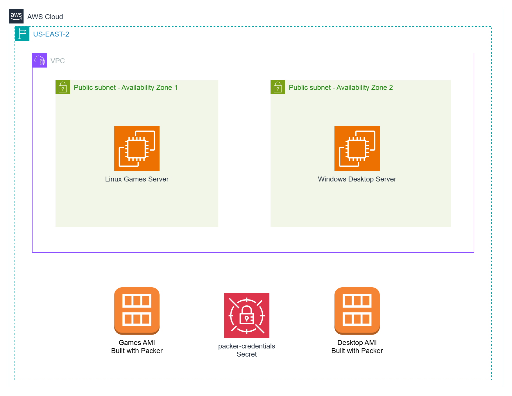

# Building AMIs with Packer in AWS  

In the AWS solution, we use Packer to build both **Linux AMIs** and **Windows AMIs**.

- For **Linux**, we configure an Ubuntu-based image with Apache and deploy several retro HTML games.
- For **Windows**, we install Chrome and Firefox, apply the **latest Windows Updates**, and configure WinRM using a custom **user data script**.
- We use the built-in **EC2 Launch tool** to perform Sysprep on Windows images, ensuring a clean and reusable AMI every time.
- Both images are configured with **AWS Systems Manager (SSM)** support, allowing you to connect and debug directly from the AWS Console without needing SSH or RDP.
- The images are built inside a user-defined **VPC and subnet**, which is created beforehand.
- We test deployments by accessing the Linux instance over **HTTP (port 80)** and the Windows instance via **RDP** using a local `packer` account with a secure password.

